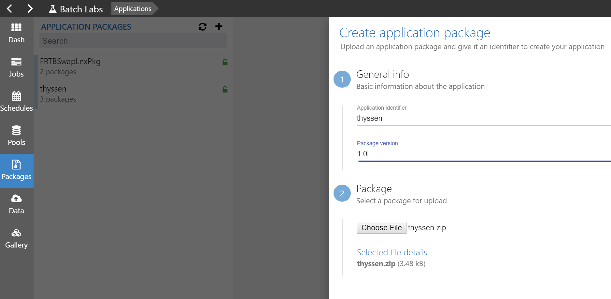

# BatchLabs template for custom app with task per file scheduling

## 1. Create Azure Batch application package with custom code
### Compile the source code on Ubuntu system:
```bash
$ gcc -o customcode customcode.c
```
### Compress with zip:
```bash
$ zip customapp.zip customcode
```
### Create an application package in BatchLabs and upload the zip file:


## 2. Create input file group
Upload input files to input file group
