# Data sharding to multiple blob storage accounts
This repository contains a recipe and scripts for massive data upload to multiple blob storage accounts with data sharding.  
It's an example implementation of [official guidance](https://docs.microsoft.com/en-us/azure/storage/blobs/storage-performance-checklist#upload-many-blobs-quickly) for quick upload of massive amount of data to blob storage, utilizing [Azure Batch service](https://azure.microsoft.com/en-us/services/batch/) for parallel data upload with [azcopy](https://aka.ms/azcopy) utility to multiple blob storage accounts - for maximizing ingress throughput.

You may find it useful if:
- you need to upload massive amount of data to blob storage quickly
- you need to shard data across multiple storage accounts because your workload's data throughput requirements exceed [scalability targets](https://docs.microsoft.com/en-us/azure/storage/common/scalability-targets-standard-account#scale-targets-for-standard-storage-accounts) of a single blob storage account.

## Prerequisites
1. Azure subscription - use your existing or create one [here](https://azure.microsoft.com/en-us/free/).
1. Azure CLI - install as described [here](https://docs.microsoft.com/en-us/cli/azure/install-azure-cli?view=azure-cli-latest)
2. [azcopy](https://aka.ms/azcopy) utility  
 Hint: Azure CLI and *azcopy* are pre-installed and directly available when using [Azure Cloud Shell (Bash)](https://shell.azure.com)   
3. Azure Batch account - create as described [here](https://docs.microsoft.com/en-us/azure/batch/batch-account-create-portal)
4. Batch Explorer - install from [here](https://azure.github.io/BatchExplorer)

## 1. Create storage accounts
The procedure below creates *n* blob storage accounts. The amount of storage accounts *n* is typically determined by your data throughput requirements versus the current [limits](https://docs.microsoft.com/en-us/azure/storage/common/scalability-targets-standard-account#scale-targets-for-standard-storage-accounts) of blob storage service (in particular the maximum throughput of a single blob storage account endpoint).
1. Create a resource group for your storage accounts (skip this step if you are planning to use an existing resource group)
```bash
$ az group create -n datasharding -l westeurope
```

2. Run [create_accounts.sh](create_accounts.sh) script  
 Usage: ./create_accounts.sh OPTIONS  
 OPTIONS:  
 -n <integer>: amount of storage accounts to create  
 -g <string>: resource group for storage accounts  
 --saprefix <string>: blob storage account name prefix.  
 --saskeyfile <string>: SAS key file to generate (optional)  
 --container <string>: blob storage container to create (optional)  

 The script creates *n* storage accounts with names *saprefix0-(n-1)*, optionally with a container and a file with SAS key tokens providing access to these accounts.  
 *Note:* The generated SAS keys are by default valid for 1 month. Please instrument ENDDATE variable in the script (line 3) to adjust it.
 
 Example: 
```bash
$ ./create_accounts.sh -n 10 -g datasharding --saprefix datasharding --saskeyfile saskeys.txt --container input
```
 The command will create 10 storage accounts [datasharding0-9] with container [input] in resource group [datasharding] and generate SAS key file [saskeys.txt].
 
 *Hints:*  
 Use [generate_saskeys.sh](generate_saskeys.sh) script whenever you need to regenerate the SAS key file for the storage accounts.  
 Use [delete_accounts.sh](delete_accounts.sh) script to delete the storage accounts.

## 2. Run Azure Batch copy job
The procedure below is an example implementation of an Azure Batch job that uploads auto-generated data samples to multiple blob storage accounts (data shards). The data samples are indexed sequentially and distributed evenly across the *n* storage accounts numbered 0-(n-1) (so-called data shards) using a mapping (sharding) function. The sharding function used in this example is a remainder of the division "data sample index"/"number of storage accounts" which determines the target storage account for each indexed sample file.

### 2a. Run Azure Batch copy job using Batch Explorer
1. Create file group containers  
Select your Batch account in *Dashboard* tab in Batch Explorer:
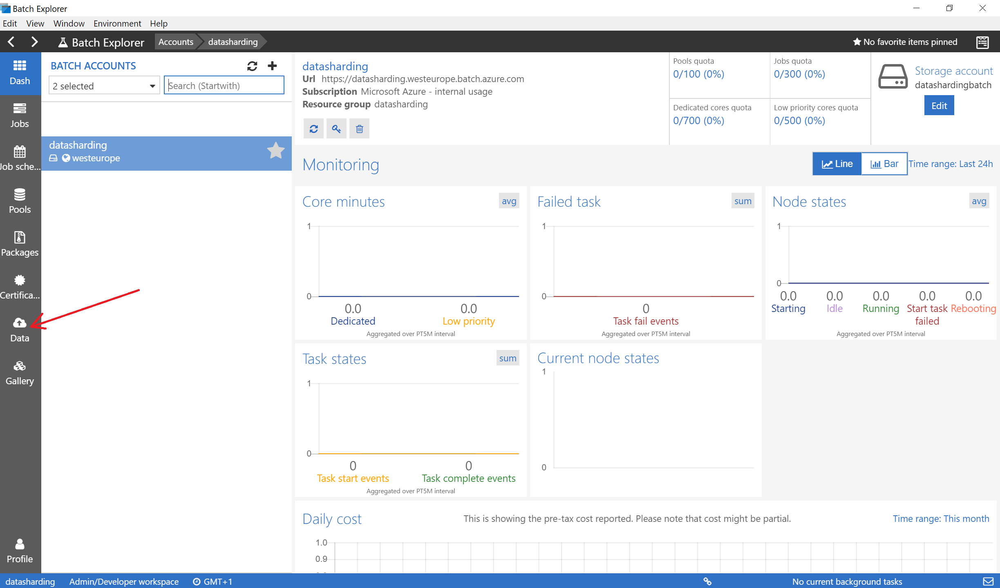
 
Goto *Data* tab and click '+' icon to create a new empty file group:
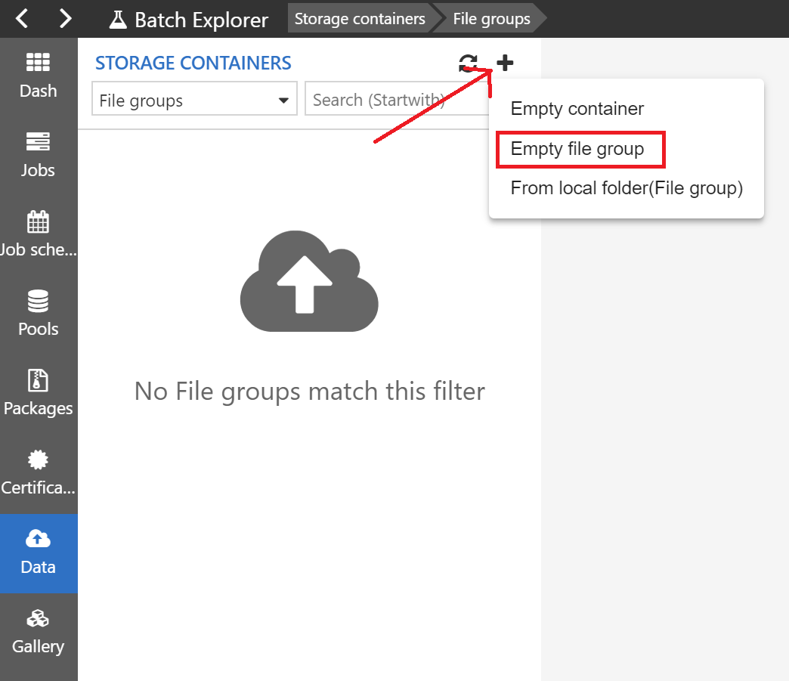

Provide a name for the pool asset file group (e.g. *datasharding-pool*).
 
Create two more empty file groups: for job assets (e.g. *datasharding-job*) and for job outputs (e.g. *output*):
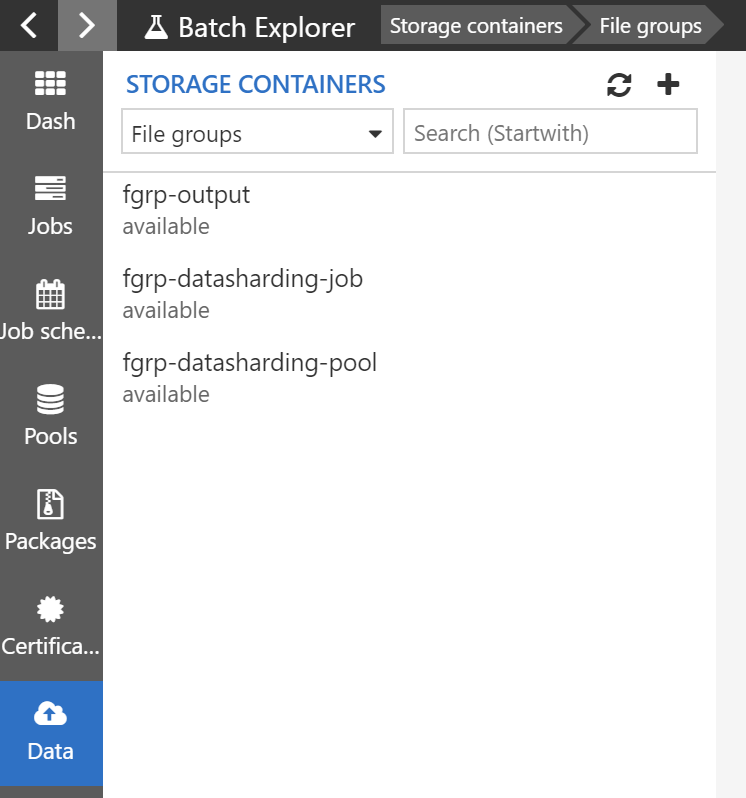

2. Provision filegroup containers for the Batch pool and job  
Download [azcopy](azcopy) binary and [datasharding-starttask.sh](datasharding-starttask.sh) script to local filesystem and then drag'n'drop from system File Explorer to *datasharding-pool* file group container:
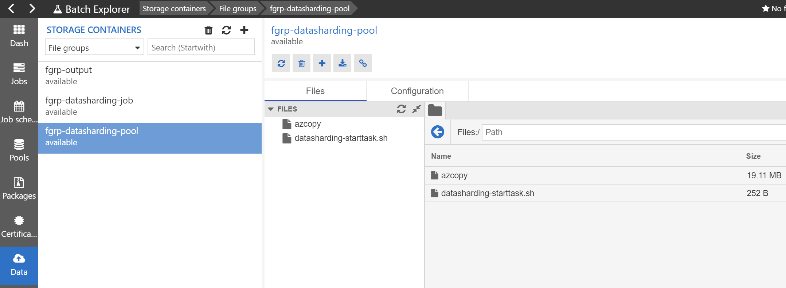
Use the local [azcopy](azcopy) or download the latest version from [aka.ms/azcopy](https://aka.ms/azcopy)  
The script *datasharding-startask.sh* will initialize the pool node for the copy job execution by:  
(1) copying azcopy binary to /usr/local/bin/  
(2) generating a data sample file of requested size (with *fallocate*) in the node's shared directory ($AZ_BATCH_NODE_SHARED_DIR) 
 
Download [datasharding-runscript.sh](datasharding-runscript.sh) script and *saskeys.txt* (generated by *create_accounts.sh* or *generate_saskeys.sh* scripts - see chpt.1) to local filesystem and then drag'n'drop from File Explorer to *datasharding-job* file group container:
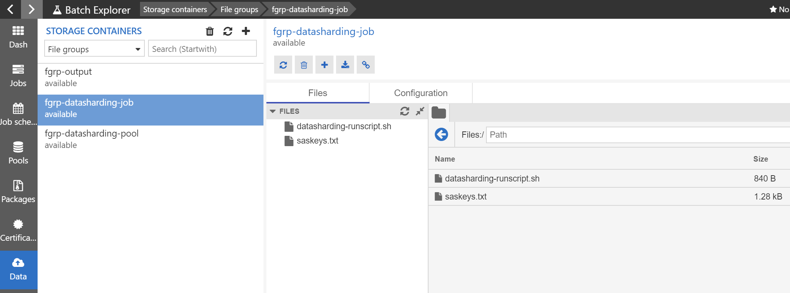
The script *datasharding-runscript.sh* implements the copy job's task.  
The copy job tasks will collectively replicate the data sample residing in each pool's shared directory to indexed copies and upload them to respective storage account determined by the sharding function.  
 
3. Create a pool from template  
Goto Batch Explorer *Gallery* tab, click *Pick a local template* and select *datasharding-pool.json* template from the local disk:
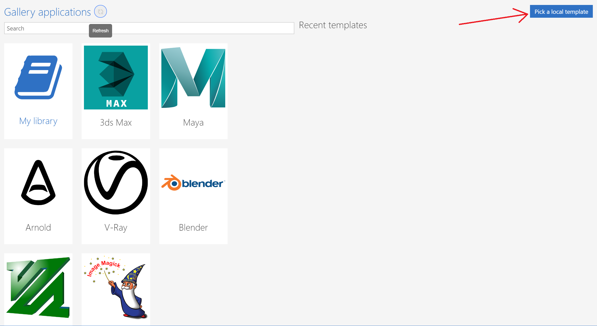
Provide the pool definition parameters or accept the default values and click *Create and close* button:
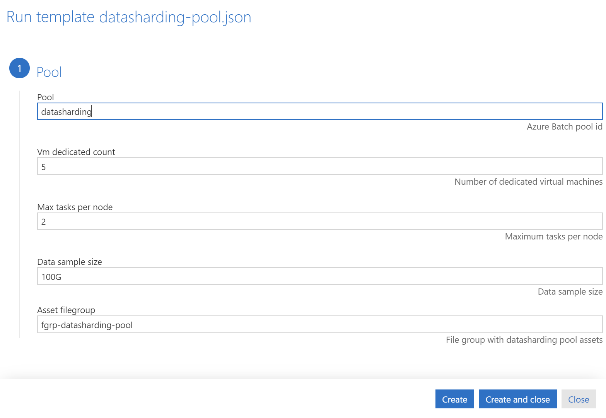
 - *pool id* - must be unique within the Batch account
 - *Vm dedicated count* - number of VMs to allocate. The optimal VM count depends on chosen "Max tasks per node", see below.  
 Note: The VM size hardcoded in the template is D64_v3 (line 55). The hardcoded VM's OS image in CentOS7.7 (*imageReference* in lines 49-51).   
 - *Max tasks per node* - how many copy jobs are allowed to run in parallel on every node. The optimal value depends on the size of copied dataset, it might require some experimentation (e.g. with *azcopy bench*). The default value is 2 (deriving the VM dedicate count equal to half of the number storage accounts, according to formula "VM dedicated count" * "Max tasks per node" = "number of storage accounts")
 - *Data sample size* - size of the autogenerated data sample, passed to *fallocate* command-line '-l' parameter 
 
4. Run a copy job from template  
Goto Batch Explorer *Gallery* tab, click *Pick a local template* and select *datasharding-job.json* template from the local disk.  
Provide the job definition parameters or accept the default values:
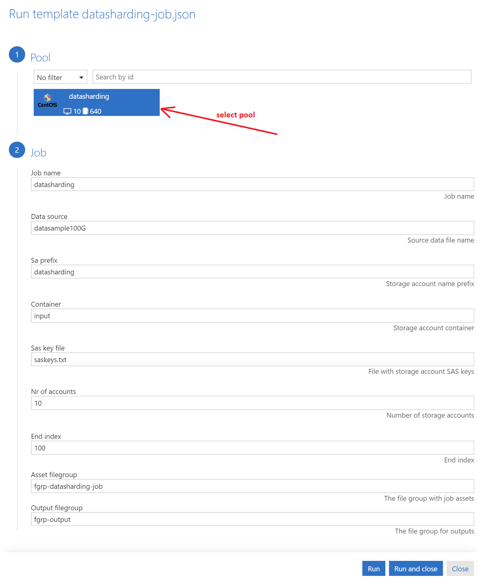
 - *Pool* - select the pool for job execution
 - *Job name* - must be unique within the Batch account
 - *Data source* - data source sample file name, the data source file is assumed to reside in $AZ_BATCH_NODE_SHARED_DIR folder on each node
 - *SA prefix* - storage account name prefix
 - *Container* - storage account container for upload of copied data
 - *SAS key file* - SAS key file, in the format generated by *create_accounts.sh* or *generate_saskeys.sh* script
 - *Nr of accounts* - the number of storage accounts
 - *End index* - the end index of data sample upload. 
 - *Asset filegroup* - file group container for the copy job assets
 - *Output filegroup* - file group container for job outputs. The copy job will persist *stdout* and *stderr* from all tasks in this file group.
 
Click *Run and close* button and wait for the job to start.  

The job will start *n* tasks - as many as there are storage accounts. Each task will replicate the data sample from its node's $AZ_BATCH_NODE_SHARED_DIR folder to multiple indexed copies, with indexes of the same sharding function value (i.e. congruent modulo *n*) in the range from 1 to *end index*, and upload them to the storage account *SA prefix* with the appropriate suffix.

Once the job is started you can observe the job status in the Batch Explorer *Jobs* tab:
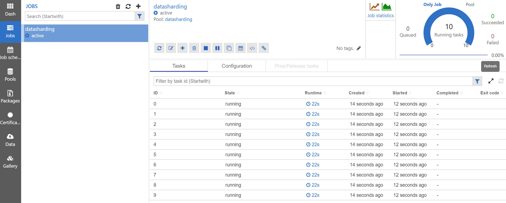
You can monitor the pool executing the job in Batch Explorer *Pools* tab.
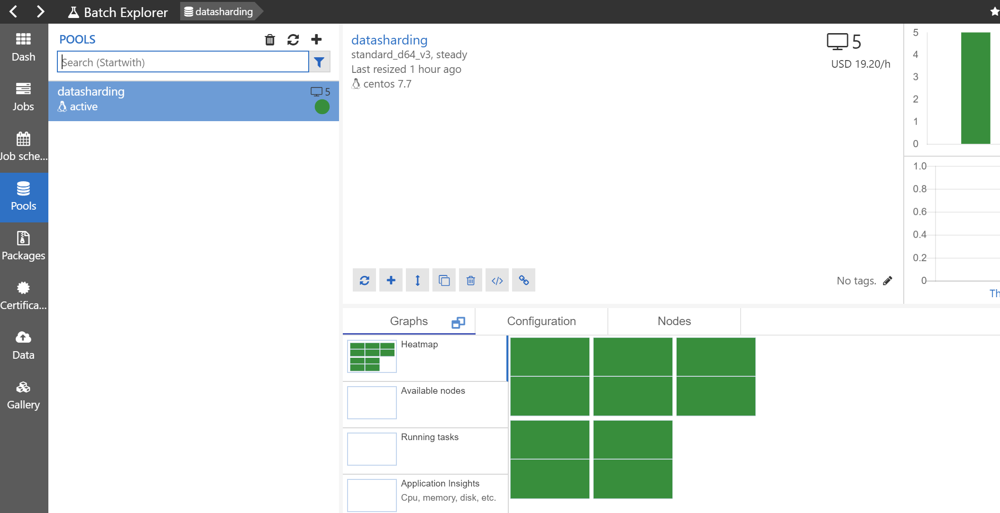
Hint: you can jump directly to the job's pool by clicking the pool link at the top of the job's status page:
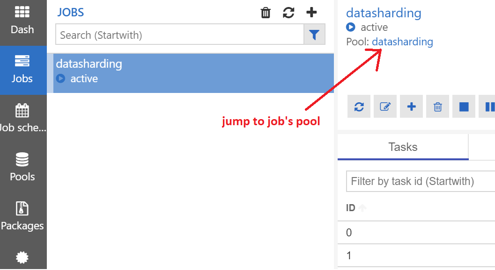
 
You can also click into each task to observe its status:
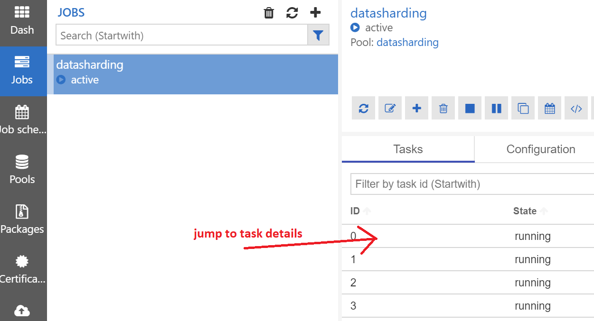
You can follow task progress e.g. by opening its stdout stream in *stdout.txt* file:
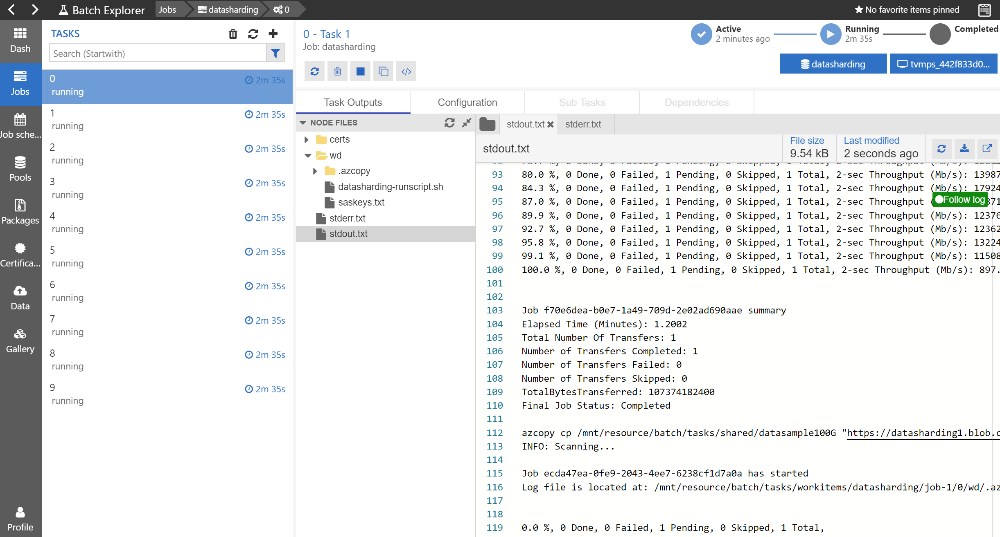

After the job is finished you will find job tasks' outputs in Batch Explorer *Data* tab in the output filegroup, under the virtual folder with the job's name:
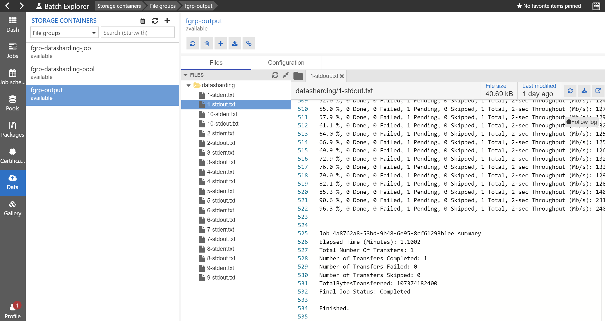

You can verify that data has been transferred successfully in [Azure portal](https://portal.azure.com) or with [Microsoft Storage Explorer](https://azure.microsoft.com/en-us/features/storage-explorer/) application:
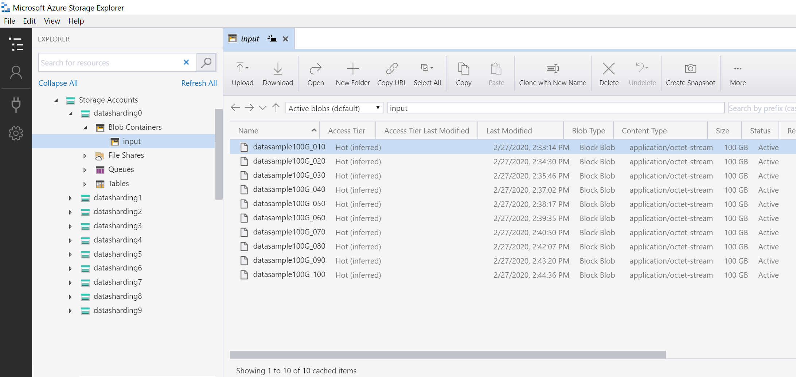
 
### 2b. Run Azure Batch copy job using Azure CLI
1. Install [Azure Batch CLI extension](https://github.com/Azure/azure-batch-cli-extensions#cli-extensions-installation)

2. Set your Batch account environment variables by sourcing [set_batch_env.sh](set_batch_env.sh) script.  
Usage: source set_batch_env.sh resourcegroup batchaccount  
- resourcegroup - resource group of the Batch account  
- batchaccount - Batch account name  

Example command for resource group "datasharding" and Batch account "datasharding": 
```bash
source set_batch_env.sh datasharding datasharding
```
After the command completes you should have the following variables defined in your environment: AZURE_BATCH_ACCOUNT, AZURE_BATCH_ENDPOINT and AZURE_BATCH_KEY:
```bash
$ env | grep BATCH
AZURE_BATCH_ACCOUNT=datasharding
AZURE_BATCH_ENDPOINT=<Batch account URL>
AZURE_BATCH_KEY=<Batch account key>
```
 
2. Provision filegroup containers for the Batch pool and job  

a) Download azcopy binary and [datasharding-starttask.sh](datasharding-starttask.sh) script to local filesystem and then upload to *datasharding-pool* filegroup container (will be automatically created):
```bash
$ az batch file upload --local-path azcopy --file-group datasharding-pool
$ az batch file upload --local-path datasharding-starttask.sh --file-group datasharding-pool
```
Use [this](azcopy) azcopy binary or download the latest version from [aka.ms/azcopy](https://aka.ms/azcopy)  

b) Download [datasharding-runscript.sh](datasharding-runscript.sh) script and *saskeys.txt* (generated by *create_accounts.sh* or *generate_saskeys.sh* scripts - see chpt.1) to local filesystem and then upload to *datasharding-job* filegroup container (will be automatically created):
```bash
$ az batch file upload --local-path datasharding-runscript.sh --file-group datasharding-job
$ az batch file upload --local-path saskeys.txt --file-group datasharding-job
```
c) Upload a dummy file to *output* filegroup container (a workaround to create an empty output filegroup)
```bash
$ touch dummyfile
$ az batch file upload --local-path dummyfile --file-group output
```

3. Create a pool from template  
Download [datasharding-pool-nodefaults.json](datasharding-pool-nodefaults.json) to local filesystem and run the following CLI command, providing parameter values when prompted. Refer to chpt. 2a pt.3 above for detailed description of the parameters. 
```bash
$ az batch pool create --template datasharding-pool-nodefaults.json
poolId (Azure Batch pool id): datasharding
maxTasksPerNode (Maximum tasks per node): 2
vmDedicatedCount (Number of dedicated virtual machines): 5
dataSampleSize (Data sample size): 100G
assetFilegroup (File group with datasharding pool assets): datasharding-pool
```

4. Run a copy job from template  
Download [datasharding-job-nodefaults.json](datasharding-job-nodefaults.json) to local filesystem and run the following CLI command, providing parameter values when prompted:
```bash
$ az batch job create --template datasharding-job-nodefaults.json
jobName (Job name): datasharding
poolId (Pool id): datasharding
nrOfAccounts (Number of storage accounts): 10
dataSource (Source data file name): datasample100G
saPrefix (Storage account name prefix): datasharding
container (Storage account container): input
sasKeyFile (File with storage account SAS keys): saskeys.txt
endIndex (End index): 100
assetFilegroup (The file group with job assets): datasharding-job
outputFilegroup (The file group for outputs): output
```
Refer to chpt. 2a pt.4 for detailed description of the parameters and how to monitor the job with Batch Explorer. 
